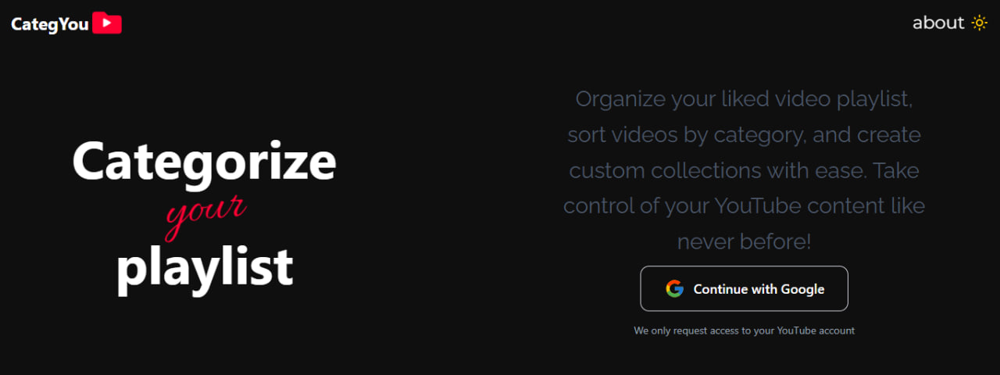

# CategYou 📂✨

CategYou is a web application designed to help you organize your YouTube liked videos playlist. With CategYou, users can organize their YouTube Liked Videos playlist with nested folders, sorting, and drag-and-drop magic!

## 🚀 Motivation
I’ve always struggled with YouTube’s "Liked Videos" playlist. Over time, it becomes a chaotic dump of hundreds (or thousands!) of videos with no way to organize them into categories. YouTube doesn’t let you create folders or sort beyond basic filters, which makes revisiting specific content frustrating.

I built **CategYou** to solve this:

- **Organize freely**: Create nested folders (like "Programming/Python/Tutorials" or "Music/Classic Rock") to mirror how my brain categorizes content.

- **Sort smarter**: Sort videos by when I added them, when they were published, or by view count to prioritize quality.

- **No more endless scrolling**: Drag-and-drop videos into folders instead of manually reordering playlists.

Imagine having a **file explorer for your YouTube likes** – that’s CategYou.

## ✨ Capabilities
CategYou empowers users to:

- **Fetch your Liked Videos** directly from YouTube’s API.

- **Create nested folders** (e.g., Tech/ReactJS/State Management).

- **Drag-and-drop** videos or folders for effortless organization.

- **Sort videos** using:

  1. Sort by date added (when you liked the video).

  2. Sort by date published (when the video uploaded).

  3. Sort by date published by view count (most-watched first).

- **Preview folder paths** with a breadcrumb trail (e.g., Home > Tech > ReactJS).

## 🎨 Product Design

- **Logo**: A familiar YouTube-inspired design with a red folder icon instead of the play button.

- **UI/UX**:

  - **Folder Explorer**: Mimics a file manager (like Windows Explorer) for intuitive navigation.

  - **Breadcrumbs**: Always visible at the top to track your location in the folder tree.

  - **Drag-and-Drop Animations**: Smooth visual feedback when moving items.

  - **Sorting Dropdown**: Prominently placed to toggle between sorting modes.

  - **Folder Structure Visualization**: Folders expand/collapse with clear hierarchy.

## 🔒 Auth

- Flow:

  1. User clicks "Login with Google".

  2. Google’s OAuth screen requests access to the user’s YouTube account.

  3. On approval, an accessToken is generated and stored in localStorage.

  4. This token fetches the user’s Liked Videos via the YouTube Data API.

**Token Handling:

- Tokens expire after 1 hour. Users are prompted to re-authenticate seamlessly.

## 🗄️ Data Storage
CategYou uses **IndexedDB** to store folder hierarchies and video relationships client-side. Below are the implementation details:
- **Database Name**: LikedVideosDB

- **Object Store**: folders

  - **id** (Primary Key)

  - **name** (Folder name)

  - **videos** (Array of video IDs that are inside the folder)

  - **subFolders** (Array of folder IDs that are inside the folder)

  - **createdAt** (When the folder is created)
